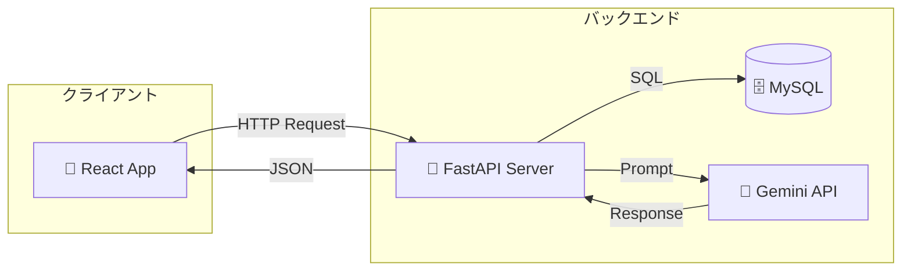
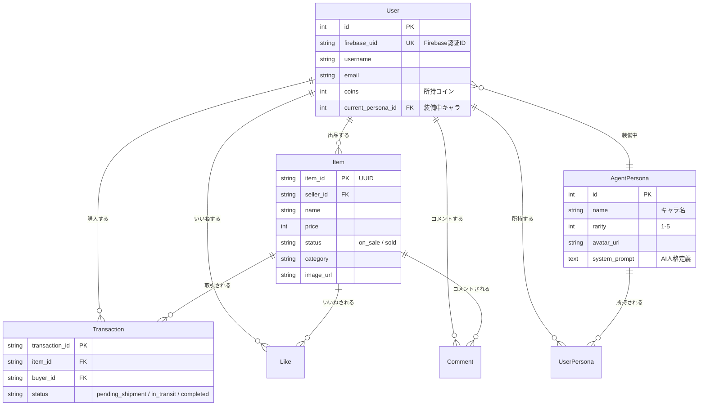
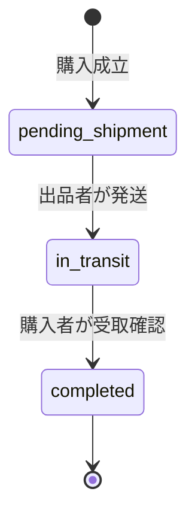
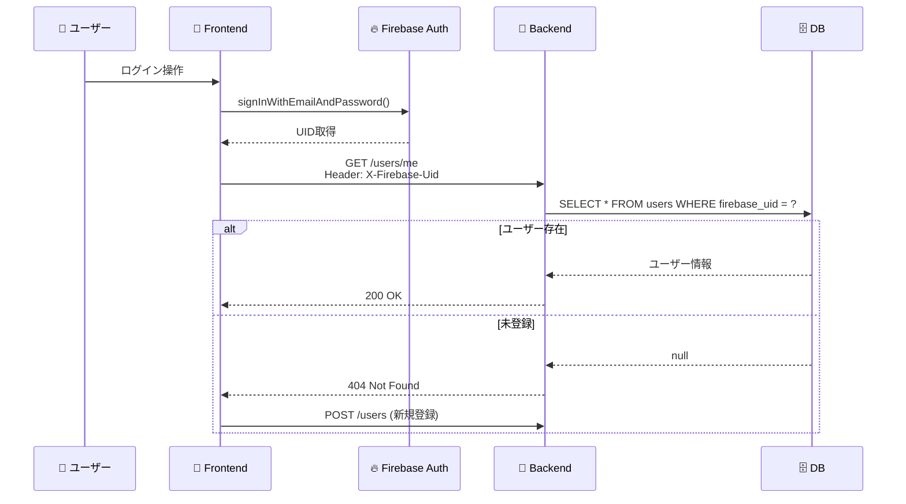
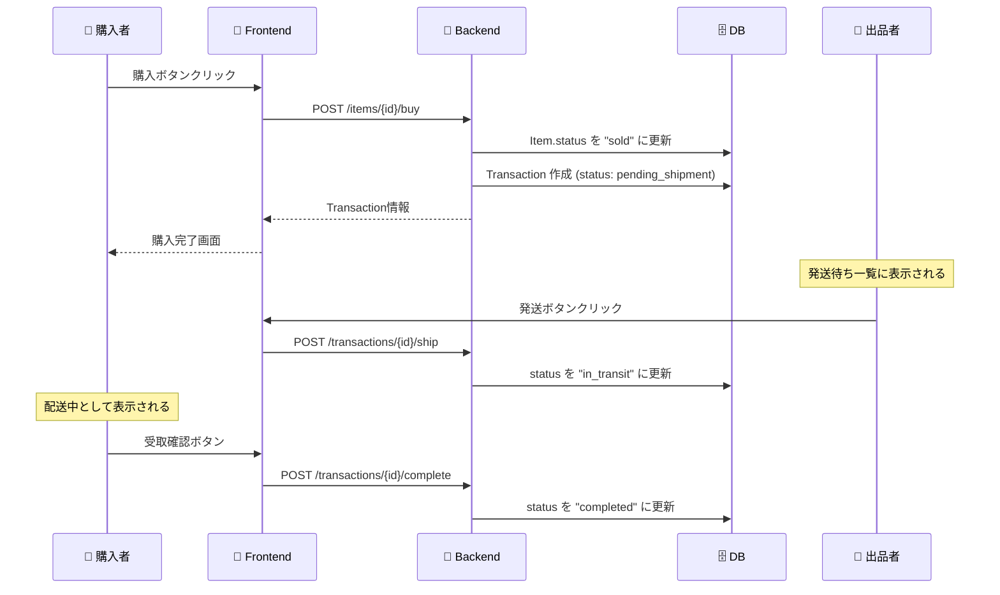
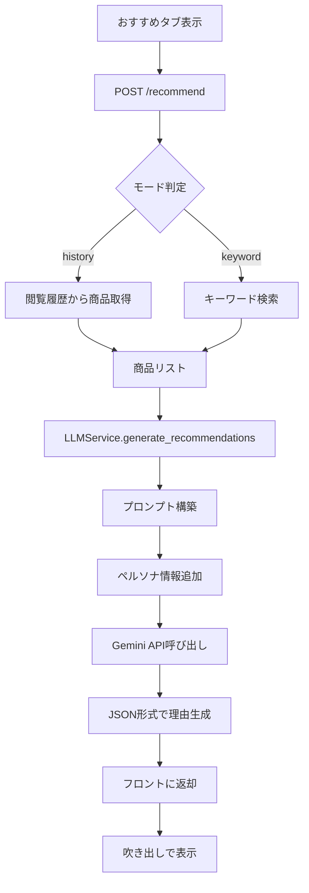
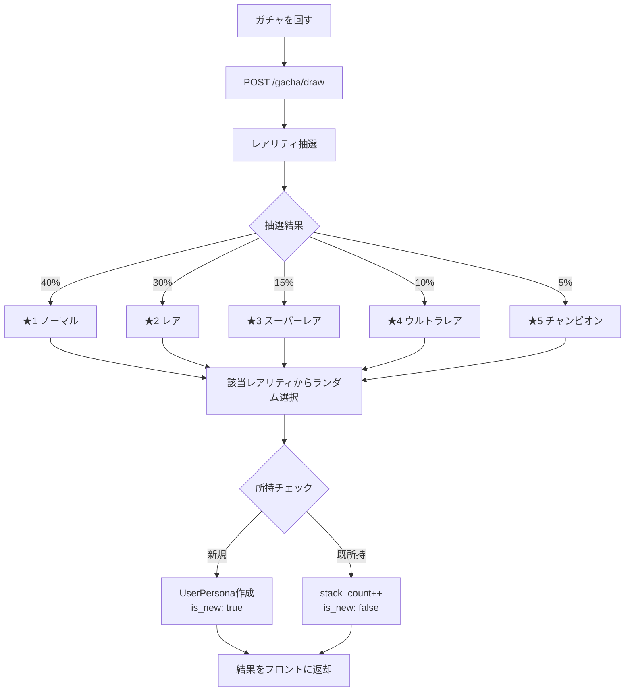

# 🛒 FleaMarketApp Backend API 完全ガイド

初心者でも「どこに何があるか」「どう動くか」を完全に理解できるドキュメントです。

---

## 📋 目次

1. [システム概要](#-システム概要)
2. [技術スタック](#-技術スタック)
3. [ディレクトリ構成](#-ディレクトリ構成)
4. [データベース設計](#-データベース設計)
5. [API エンドポイント一覧](#-api-エンドポイント一覧)
6. [機能別 詳細解説](#-機能別-詳細解説)
7. [セットアップ手順](#-セットアップ手順)

---

## 🏗 システム概要

このバックエンドは「AIキャラクターと一緒に買い物を楽しむフリマアプリ」のAPIサーバーです。



---

## 🛠 技術スタック

| カテゴリ | 技術 | 用途 |
|---------|------|------|
| **言語** | Python 3.11 | サーバーサイドロジック |
| **フレームワーク** | FastAPI | REST API構築 |
| **ORM** | SQLAlchemy | データベース操作 |
| **データベース** | MySQL (Cloud SQL) | データ永続化 |
| **AI** | Google Gemini API | チャット・レコメンド |
| **認証** | Firebase Auth (UID連携) | ユーザー認証 |

---

## 📂 ディレクトリ構成

```plaintext
hackathon-backend/
├── app/
│   ├── main.py                    # 🚀 FastAPI起動ファイル
│   │
│   ├── api/v1/endpoints/          # 📡 APIエンドポイント (10ファイル)
│   │   ├── users.py               # ユーザー管理 (9 API)
│   │   ├── items.py               # 商品管理 (8 API)
│   │   ├── transactions.py        # 取引管理 (3 API)
│   │   ├── chat.py                # AIチャット (1 API)
│   │   ├── gacha.py               # ガチャ (2 API)
│   │   ├── mission.py             # ミッション＆クーポン (8 API)
│   │   ├── llm.py                 # LLMコンテキスト (2 API)
│   │   ├── recommend.py           # おすすめ (1 API)
│   │   ├── rewards.py             # 報酬 (1 API)
│   │   └── search.py              # 検索 (1 API)
│   │
│   ├── core/
│   │   └── config.py              # ⚙️ 環境変数・設定
│   │
│   ├── db/
│   │   ├── models.py              # 📝 データモデル定義
│   │   ├── database.py            # 🔌 DB接続
│   │   └── data/personas.py       # AIキャラクター初期データ
│   │
│   ├── schemas/                   # 📋 Pydantic型定義
│   │   ├── user.py, item.py       # リクエスト/レスポンス型
│   │   └── ...
│   │
│   ├── services/                  # 🧠 ビジネスロジック
│   │   ├── llm_service.py         # Gemini連携
│   │   ├── llm_base.py            # LLM共通処理
│   │   ├── mission_service.py     # ミッション・クーポン処理
│   │   └── prompts.py             # AIプロンプト定義
│   │
│   └── utils/                     # 🔧 共通ユーティリティ
│       └── time_utils.py          # JST時間処理
│
├── requirements.txt               # 📦 依存ライブラリ
└── Dockerfile                     # 🐳 コンテナ設定
```

---

## 🗄 データベース設計

主要テーブルとその関係です。



---

## 📡 API エンドポイント一覧

### 認証について
全ての保護されたAPIは、リクエストヘッダーに `X-Firebase-Uid: {firebase_uid}` を必要とします。

---

### 1. 👤 ユーザー管理 (`/api/v1/users`)

| メソッド | パス | 説明 | 認証 |
|----------|------|------|------|
| `POST` | `/` | 新規ユーザー登録 | 不要 |
| `GET` | `/me` | 自分のユーザー情報取得 | 必要 |
| `GET` | `/personas` | 全キャラクター一覧 | 不要 |
| `GET` | `/me/personas` | 所持キャラクター一覧 | 必要 |
| `PUT` | `/me/persona` | 装備キャラ変更 | 必要 |
| `GET` | `/me/items` | 自分の出品一覧 | 必要 |
| `GET` | `/me/transactions` | 自分の購入履歴 | 必要 |
| `GET` | `/me/likes` | いいねした商品一覧 | 必要 |
| `GET` | `/me/comments` | コメントした商品一覧 | 必要 |

---

### 2. 🛍 商品管理 (`/api/v1/items`)

| メソッド | パス | 説明 | 認証 |
|----------|------|------|------|
| `GET` | `/` | 全商品一覧（販売中） | 不要 |
| `GET` | `/{item_id}` | 商品詳細取得 | 不要 |
| `POST` | `/` | 新規商品出品 | 必要 |
| `POST` | `/{item_id}/buy?coupon_id=X` | 商品購入（クーポン適用可） | 必要 |
| `GET` | `/{item_id}/available-coupons` | 使用可能な送料クーポン一覧 | 必要 |
| `POST` | `/{item_id}/like` | いいね登録/解除 | 必要 |
| `POST` | `/{item_id}/comments` | コメント投稿 | 必要 |
| `GET` | `/{item_id}/recommend` | 類似商品レコメンド | 不要 |

---

### 3. 📦 取引管理 (`/api/v1/transactions`)

| メソッド | パス | 説明 | 認証 |
|----------|------|------|------|
| `GET` | `/` | 取引一覧（role=seller/buyer） | 必要 |
| `POST` | `/{id}/ship` | 発送完了（出品者用） | 必要 |
| `POST` | `/{id}/complete` | 受取完了（購入者用） | 必要 |



---

### 4. 🎰 ガチャ (`/api/v1/gacha`)

| メソッド | パス | 説明 |
|----------|------|------|
| `GET` | `/available-coupons` | 使用可能なガチャクーポン一覧 |
| `POST` | `/draw?coupon_id=X` | ガチャを1回引く（クーポン適用可） |

**レアリティ排出率:**
| レアリティ | 確率 |
|-----------|------|
| ノーマル (★1) | 40% |
| レア (★2) | 30% |
| スーパーレア (★3) | 15% |
| ウルトラレア (★4) | 10% |
| チャンピオン (★5) | 5% |

**クーポン適用:**
- `gacha_discount` タイプのクーポンで割引可能
- 例: 15%OFFクーポン → 100pt → 85pt

---

### 5. 💬 AIチャット (`/api/v1/chat`)

| メソッド | パス | 説明 |
|----------|------|------|
| `POST` | `/` | AIキャラクターと会話 |

**リクエスト例:**
```json
{
  "message": "おすすめの靴ある？",
  "page_context": {
    "page_type": "item_detail",
    "item_id": "abc123"
  }
}
```

---

### 6. ⭐ おすすめ (`/api/v1/recommend`)

| メソッド | パス | 説明 |
|----------|------|------|
| `POST` | `/` | AIがおすすめ商品を提案 |

**モード:**
- `history`: 閲覧履歴ベース
- `keyword`: キーワード指定

---

### 7. 🔍 検索 (`/api/v1/search`)

| メソッド | パス | 説明 |
|----------|------|------|
| `GET` | `/items?query=xxx` | テキスト検索 |

---

### 8. 🎁 報酬 (`/api/v1/rewards`)

| メソッド | パス | 説明 |
|----------|------|------|
| `POST` | `/claim/seeing_recommend` | おすすめ閲覧報酬を受け取る |

---

### 9. 🤖 LLMコンテキスト (`/api/v1/llm`)

| メソッド | パス | 説明 |
|----------|------|------|
| `POST` | `/context` | ページ遷移時のAIガイダンス取得 |
| `POST` | `/function` | Function Calling実行 |

---

### 10. 🎯 ミッション＆クーポン (`/api/v1/mission`)

| メソッド | パス | 説明 |
|----------|------|------|
| `GET` | `/missions` | 全ミッション状況取得 |
| `GET` | `/coupons` | 所持クーポン一覧 |
| `POST` | `/daily-login/claim` | デイリーログインボーナス受取 |
| `POST` | `/daily-coupon/claim` | デイリークーポン受取 |
| `POST` | `/first-listing/claim` | 初出品ボーナス受取 |
| `POST` | `/first-purchase/claim` | 初購入ボーナス受取 |
| `POST` | `/login-streak/claim` | 連続ログイン3日ボーナス受取 |
| `POST` | `/weekly-likes/claim` | 週間いいね5回ボーナス受取 |

**ミッション報酬一覧:**
| ミッション | 報酬 | リセット |
|-----------|------|---------|
| デイリーログイン | 🎫 50pt | 毎日 |
| デイリークーポン | 🎟️ クーポン | 毎日 |
| 初めての出品 | 🎫 200pt | 一回限り |
| 初めての購入 | 🎫 200pt | 一回限り |
| 連続ログイン3日 | 🎫 100pt + クーポン | 一回限り |
| 週間いいね5回 | 🎫 30pt | 毎週 |

**クーポン種別:**
| タイプ | 効果 | 使用場面 |
|-------|------|---------|
| `shipping_discount` | 送料〇%OFF | 商品購入時 |
| `gacha_discount` | ガチャ〇%OFF | ガチャ実行時 |

---

## 🔄 機能別 詳細解説

### 1. 🔑 認証フロー



---

### 2. 🛍 商品購入フロー



---

### 3. 🤖 AIレコメンド生成フロー



---

### 4. 🎰 ガチャシステム



---

## 🚀 セットアップ手順

### 1. 依存関係インストール
```bash
pip install -r requirements.txt
```

### 2. 環境変数設定 (`.env`)
```ini
# データベース
DB_USER=root
DB_PASS=your_password
DB_NAME=hackathon
INSTANCE_CONNECTION_NAME=your-project:region:instance

# AI
GEMINI_API_KEY=your_gemini_api_key

# その他
REACT_APP_API_URL=http://localhost:8080
```

### 3. サーバー起動
```bash
uvicorn app.main:app --reload --port 8080
```

### 4. APIドキュメント確認
ブラウザで `http://localhost:8080/docs` にアクセスすると、Swagger UIで全APIをテストできます。

---

## 📝 開発Tips

### 新機能追加の流れ

1. **データモデル**: `app/db/models.py` にテーブル定義
2. **スキーマ**: `app/schemas/` にPydanticモデル定義
3. **エンドポイント**: `app/api/v1/endpoints/` に関数定義
4. **ルーター登録**: `app/main.py` でinclude

### よく使うコマンド

```bash
# サーバー起動（開発モード）
uvicorn app.main:app --reload

# Docker ビルド
docker build -t hackathon-backend .

# Docker 実行
docker run -p 8080:8080 -e PORT=8080 hackathon-backend
```

---

Happy Coding! 🚀